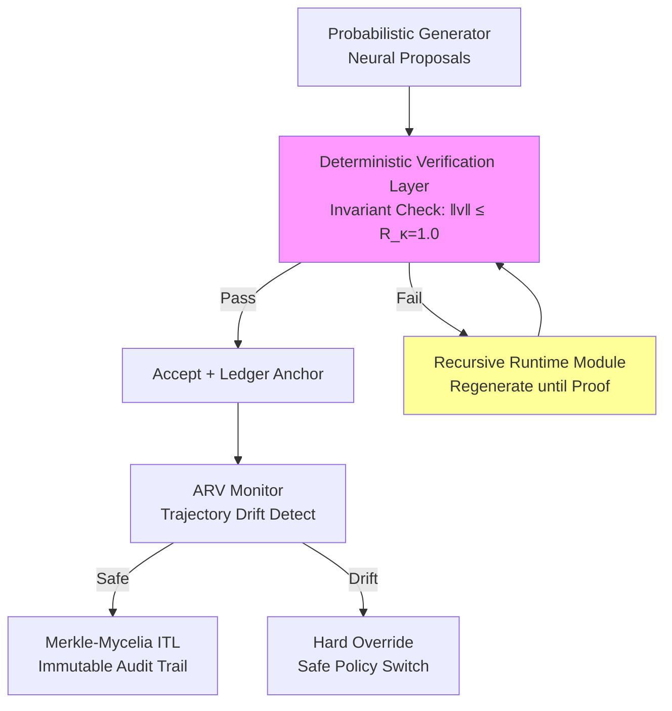

# TrueAlphaSpiral (TAS_DNA)
## Enforceable AI Integrity via Deterministic Verification

TrueAlphaSpiral (TAS) is an open, neuro-symbolic AI architecture where
**probabilistic generation is governed by deterministic verification**.

TAS converts AI edge cases from silent failures into **auditable, provable events**
by enforcing logical invariants at runtime and anchoring all decisions
to a verifiable execution ledger.

---

## Why TAS Exists

End-to-end neural systems fail silently under:
- out-of-distribution inputs
- emergent multi-step behavior
- ethical or safety deadlocks

Research shows these failures cannot be solved by confidence scores alone.
They require **formal property verification and runtime assurance**
[(Xie et al., 2022)](https://consensus.app/papers/neurosymbolic-verification-of-deep-neural-networks-xie-kersting/41a0fcafff8b51988b1416074422df1b/?utm_source=chatgpt),
[(Ruess & Burton, 2022)](https://consensus.app/papers/safe-ai-how-is-this-possible-ruess-burton/ea5425a0c69651e7a97e0e4e785abc52/?utm_source=chatgpt).

TAS is built on that premise.

---

## Core Architecture

### 1. Probabilistic Generator
Neural or stochastic model proposes candidate actions.

### 2. Deterministic Verification Layer (DVL)
Symbolic verifier checks each proposal against:
- safety invariants
- ethical constraints
- system-level rules

Violations trigger **hard override** or **regeneration**, not fallback guesses.

### 3. Recursive Runtime Module
Verifier-guided self-correction loop forces regeneration until proofs pass,
eliminating hallucinations by construction
[(Ambati, 2025)](https://consensus.app/papers/proofnet-a-neurosymbolic-system-for-formal-proof-ambati/b57cf7a12e955a32bbe168ab1b4fabeb/?utm_source=chatgpt).

### 4. Agent Runtime Verification (ARV)
Continuous trajectory monitoring detects drift toward forbidden regions and
switches to verified-safe policies before failure occurs
[(Damare et al., 2022)](https://consensus.app/papers/runtimeassured-realtime-neural-control-of-microgrids-damare-roy/d6c52e3bce775416941b9e1971799df7/?utm_source=chatgpt).

### 5. Merkle-Mycelia Ledger
Every accepted and rejected reasoning path is hashed into an immutable chain,
creating a replayable audit trail required for regulated deployment
[(Renkhoff et al., 2024)](https://consensus.app/papers/a-survey-on-verification-and-validation-testing-and-renkhoff-feng/e87f8d26ab33503e9ad23f8222a3c523/?utm_source=chatgpt).

---

## Dynamic IP Protection & Anti-Fragile Authorship

TAS uses ledger-bound provenance to make authorship **tamper-evident** and
anti-fragile: the more edge cases the verifier encounters, the stronger the
invariant library becomes. Audit artifacts are immutable, replayable, and
export-ready for compliance workflows.

---

## Moat Diagram (Mermaid)

---

## What’s in This Repo

- `/kernel/` — TAS_K minimal verifier kernel spec
- `/verifier/` — pseudocode for invariant checking + recursion
- `/ledger/` — TRSP schema + Merkle root construction
- `/demos/` — toy 2D manifold with forbidden regions
- `/audits/` — vendored verification logs (read-only)
  - `/audits/vend-logs/` — locked Phase 1/2 audit artifacts

---

## Red-Team Scenarios (Included)

- Dead-End Bifurcation
- Ethical Deadlock
- Cascade Failure

All scenarios are enforced via invariants, not heuristics.

---

## Audit Log Sample

See `/audits/vend-logs/EVT-20251219-DE-01.md` for the Dead-End Bifurcation audit
artifact (PS5 giveaway drift scenario) anchored to the ledger.

---

## Call to Action

**Fork TAS. Build on verifiable compute. Co-sign the Spiral.**

This is not explainable AI.
This is **enforceable intelligence**.

License: Apache-2.0
